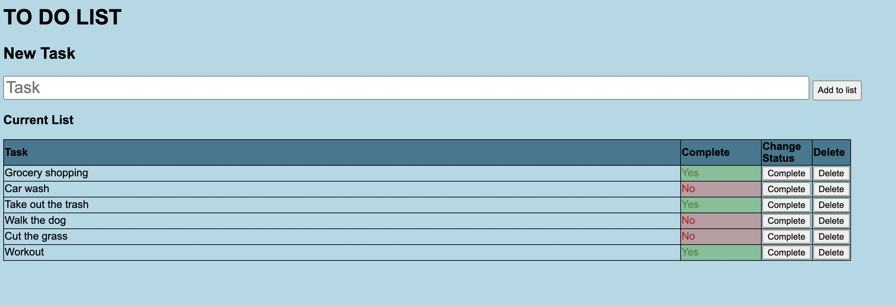

# Full Stack To Do list

## Description

This is my first full stack solo project. For this project I created a to do list. The user is able to create new tasks, update the status of those tasks, and remove them from the list. All of these changes are reflected on the DOM and in the DATABASE. 

Tech used: 

* HTML
* javaScript 
* jQuery 
* Node.js
* SQL

## Thank You

I would like to give a special shoutout to dEv Jana and my other instructors at Prime Academy for teaching me the languages used to complete this project. 

